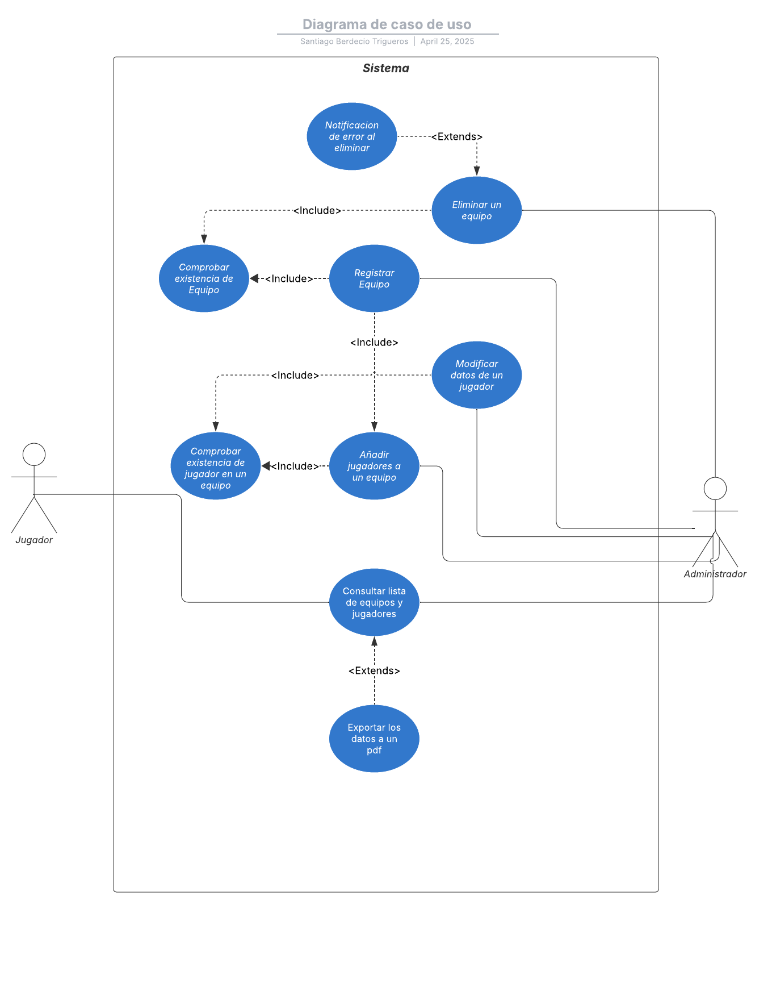
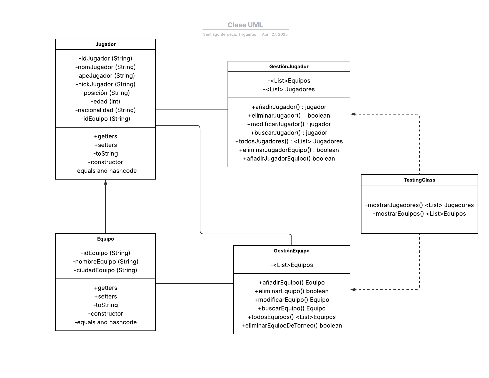

# Sistema de Gestión de Torneos de eSports

## Autor
- **Nombre:** Santiago Berdecio Trigueros  
- **GitHub:** [SantiagoBerdecio](https://github.com/SantiagoBerdecio)

## Descripción del Proyecto
El proyecto implementa un sistema de gestión de torneos de **eSports** utilizando **UML** para el modelado estructural y funcional.  
Incluye:
- Diagramas de casos de uso.
- Diagramas de clases.
- Diseño estructural del sistema.

Este proyecto busca facilitar la organización y seguimiento de torneos de videojuegos, optimizando procesos mediante un diseño bien estructurado.

## Diagramas UML
### Diagramas de caso de uso

### Diagrama de Clases

## Estructura del Proyecto
torneo-esports-uml/ ├── src/ │ └── es/ │ └── empresa/ │ └── torneo/ │ └── Main.java ├── diagrams/ │ ├── casos-uso.png │ └── clases.png ├── README.md

## Justificación del diseño
Para el desarrollo de este proyectomse ha comenzado analizando los principales actores en el diagrama de casos de uso, para su posterior implementación en el desarrollo del diagrama UML.

- Casos de uso: Se definieron como los actores a los jugadores, administradores y el sistema. A través del administrador se pueden concretar ciertos casos de uso como "Registrar Equipo", "Modificar datos de un jugador", "Añadir jugador a un equipo", "Eliminar un equipo" y "Consultar lista de equipos y jugadores". Por otra parte, el actor jugador le hemos dado la posibilidad del mismo caso de uso "Consultar lista de equipos y jugadores", de esta forma podemos ver que ambos actores comparten casos de uso.
- Diagrama de clases: Como entidades identificadas en este punto, se han determinado las siguientes: Jugador y Equipo; como entidades de control: GestiónJugador y GestiónEquipo; como interfaz: TestingClass. Cada una de estas entidades cuentan con atributos y métodos, algunos con métodos propios y otros no.
- Relaciones UML: 
    - Asociación
    La relación de asociación se encuentra presente en la clase GestiónJugador porque muestra directa asociación con la clase Equipo y Jugador, al igual que entre la clase GestiónEquipo y la clase Equipo. Mantienen una relación al usar sus listas de objetos y se efectúan operaciones sobre ellos, pero no les pertenecen esas entidades.
    
    - Composición
    La relación de composición se encuentra presente desde la clase Jugador hacia la clase Equipo, porque la clase Equipo contiene una lista de jugadores, supongamos que al momento de desaparecer un equipo, los jugadores podrían desaparecer.
    
    - Dependencia
    La relación de dependencia existe desde la clase TestingClass porque depende estrictamente de los métodos de las clases de GestiónJugador y GestiónEquipo.
    
---
